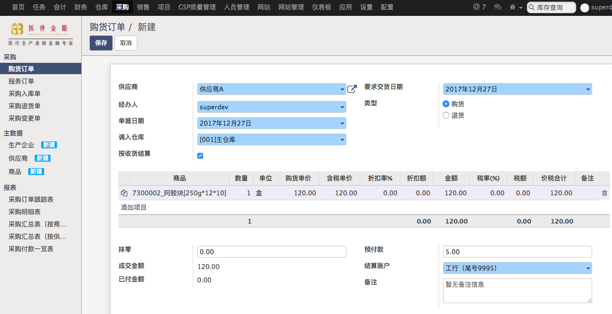

# 购货订单

由采购员填写，采购部经理审核后才算下单成功。

* 选择供应商后，商品区域只能选择该供应商供货的商品
* 商品的单位是最小单位，不是大件装量
* 商品的采购价格是由该供应商的供货价格，可以在商品的详情页面修改
* 结算账户是指公司向供应商付款的账户，用于财务统计
* 如果有预付款会在财务模块生成付款单，财务审核后成为已付款
* 所有关联该采购订单的入库单、退货单可以在右上角查看，审核后可见