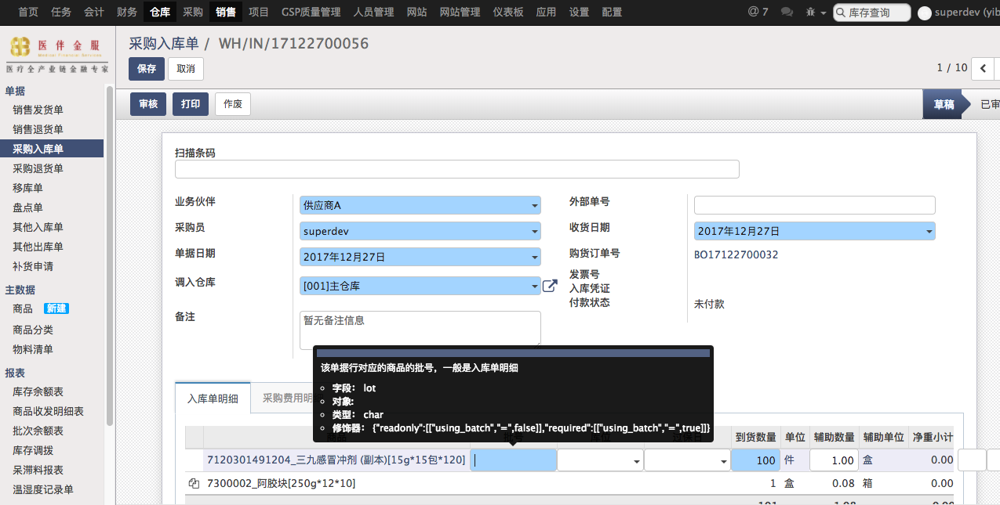
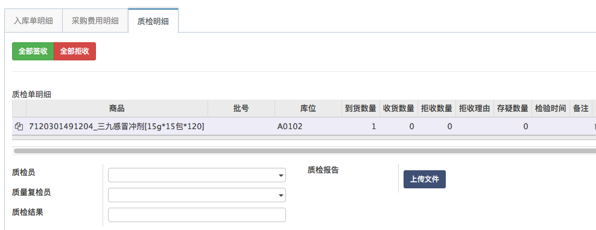

# 采购收货入库

采购订单审核通过后生成采购入库单

仓库收货后填入外部快递单号、库位、批号、过期日等信息生成质检单，无需质检的直接入库

如果有需要退货的订单，需要先入库后再选择生成退货单。所有的退货单都要关联入库单。

* 是否需要填写批号是商品详情页进行配置的，例如医疗器械有些就不用批号管理
* 药品的过期日是必填字段，用于后续的过期商品管理
* 采购费用tab用于填写该次采购流程中发生的额外费用，例如请客吃饭、附带别的打款等
* 质检tab显示该订单的质检情况，由质检人员填写。也可以在GSP质量管理-采购入库质检处集中填写

* 入库的数量由质检员填写的收货数量决定
* 质检拒收需要填写拒收的理由，拒收的数量会提示创建采购退货单。拒收+收货数量=到货数量