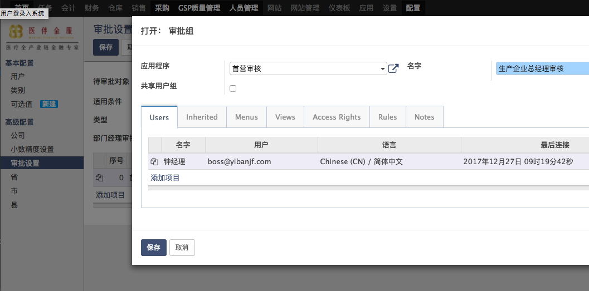

# 客户首营审批
由于同生产企业一样都属于业务伙伴，所以大部分流程可以参考[生产企业首营审批流程](factory_check.md)。

注意客户的类型是CUS，生产企业是MNF。

## 审批人员设置
* 菜单：配置-高级配置-审批设置
* 创建审批规则
  * 待审批对象：业务伙伴
  * 类型：**CUS**
  * 如果需要部门经理先行审批的项目，勾选部门经理审批
  * 在下面列表选择添加项目，弹出框中设置审批组和审批人，可以添加多个项目，用序号来安排审批顺序，越小的越靠前
  
  
## 审批流程
除了类型选择供应商外，其他流程同生产企业。

注意填写客户的联系人信息，这是作为默认的发货信息。

* 菜单：销售 > 主数据 > 客户
* 流程：新建 > 首营审批 > 审核通过