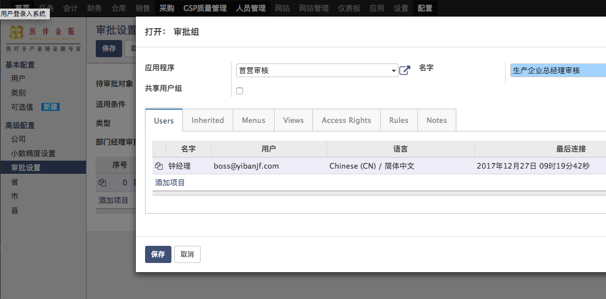

# 生产企业首营审批

## 审批人员设置
* 菜单：配置-高级配置-审批设置
* 创建审批规则
  * 待审批对象：业务伙伴
  * 类型：MNF
  * 如果需要部门经理先行审批的项目，勾选部门经理审批
  * 在下面列表选择添加项目，弹出框中设置审批组和审批人，可以添加多个项目，用序号来安排审批顺序，越小的越靠前
  
  * 如果勾选了需要本组用户全部审批，则该组用户所有成员都通过才算通过，否则只要该组的一名成员通过即可
  
  
  
## 审批流程
* 菜单：采购 > 主数据 > 生产企业
* 流程：新建 > 首营审批 > 审核通过
* 填写生产企业名称、联系人、选择负责人员(我方对接人）
* 业务伙伴类型选择生产企业
* 填写认证信息，营业执照、生产证等信息，注意填写有效期

  
  
* 保存后进入首营审批环节, 此时审核不可用

  
  
# 审核人员审批
* 登录后在待审批标签页内查看所有需要审批的事项
  
* 详情页面点击**同意**或者**拒绝**
  
* 也可以新建消息通知申请人补齐资料，语法类似微信使用@标记调出人员
* 如果是最后一名审批者，同意后相当于自动首营审核通过进入可用列表
* 如果是顺序审批，需要等待之前的审批者通过
  