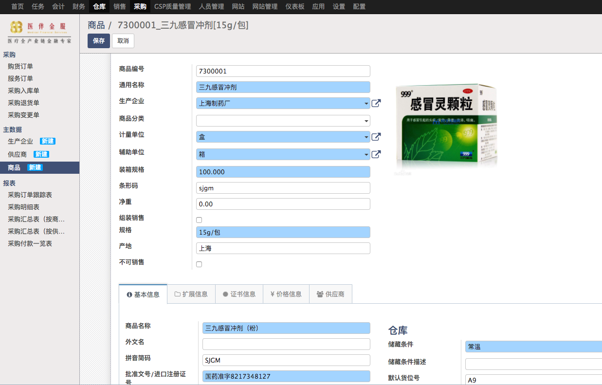
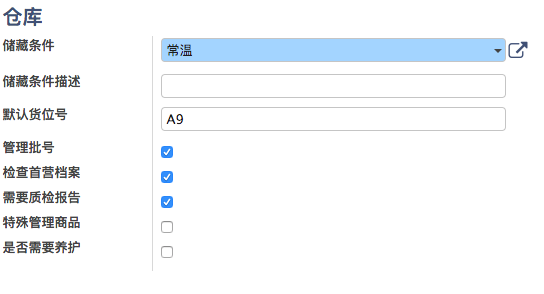

# 商品首营审批

一般由采购人员添加商品的首营审批，注意添加前需要先行添加生产企业，供应商。因为商品的生产企业需要优先通过审批。

## 新增商品

蓝色的字段都为必填字段。注意填写批准文号和证书信息

 
 
* 生产企业的下拉列表中只会显示通过首营审批的企业
* 勾选管理批号后，每次到货都需要收货人员填写批号信息，默认勾选
* 勾选需要质检报告后，每次到货都会自动生成质检单，只有通过质检才能入库
* 勾选需要养护后，可以在养护模块中选择该商品

 
* 价格信息分为成本价和零售价，这是后续填写销售单或者采购单默认的价格。如果供应商有单独报价，则采用供应商的报价
* 同所有首营审批一样，需要所有审批人员通过审批后才进入商品库供采购和销售人员使用